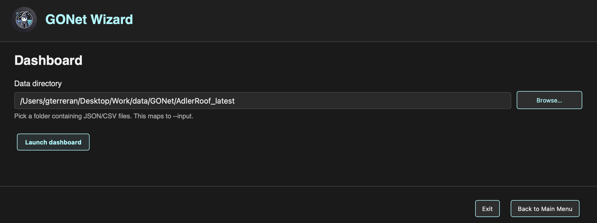

Dashboard
=========

The **Dashboard** form launches the GONet Dashboard from the graphical
interface.

.. note::

   This page explains how to launch the dashboard from the GUI.

   To learn what the dashboard does after it opens, including plotting,
   filtering, point selection, and export behavior, see
   :doc:`dashboard tool guide <../tools/dashboard>`.

   Dashboard form in the GONet Wizard graphical interface.

Overview
--------

The Dashboard form is used to select a folder containing extracted data
products and launch the interactive dashboard.

Unlike the image inspection, metadata inspection, and extraction forms, the
dashboard works primarily with directories rather than individual image files.

The selected data directory should contain the JSON or CSV files that will be
loaded into the dashboard.

Selecting the Data Directory
----------------------------

The **Data directory** field defines the folder containing the dashboard input
files.

This folder should contain JSON or CSV data products produced by GONet Wizard,
such as extraction outputs.

The directory can be selected in two ways.

Typing a Folder Path
~~~~~~~~~~~~~~~~~~~~

A folder path may be typed directly into the text field.

Browsing for a Folder
~~~~~~~~~~~~~~~~~~~~~

The **Browse...** button opens a folder picker.

When the folder is selected, its path is inserted into the input field
automatically.

Image Previews
--------------

The dashboard can show the GONet image associated with a selected plotted
point.

No separate images directory is required. The dashboard reads the full image
path from the ``filename`` field stored in the loaded extraction JSON products.
If the file cannot be found or opened, the dashboard displays a non-breaking
``File not found`` message in the image-preview area.

Launching the Dashboard
-----------------------

To launch the dashboard:

#. Select a data directory containing JSON or CSV files.
#. Click **Launch dashboard**.

The dashboard opens in a dedicated window.

Navigation Buttons
------------------

The buttons at the bottom of the window control the GUI session.

**Back to Main Menu**
   Returns to the launcher without running the current form.

**Exit**
   Closes the graphical interface.

Relationship to the CLI
-----------------------

The Dashboard form is the graphical frontend for the ``dashboard`` command.

Both interfaces use the same dashboard application and load the same data
products.

See Also
--------

* :doc:`GUI launcher guide <launcher>`
* :doc:`extraction tool guide <../tools/extract_measurements>`
* :doc:`dashboard CLI reference <../cli_reference/dashboard>`
