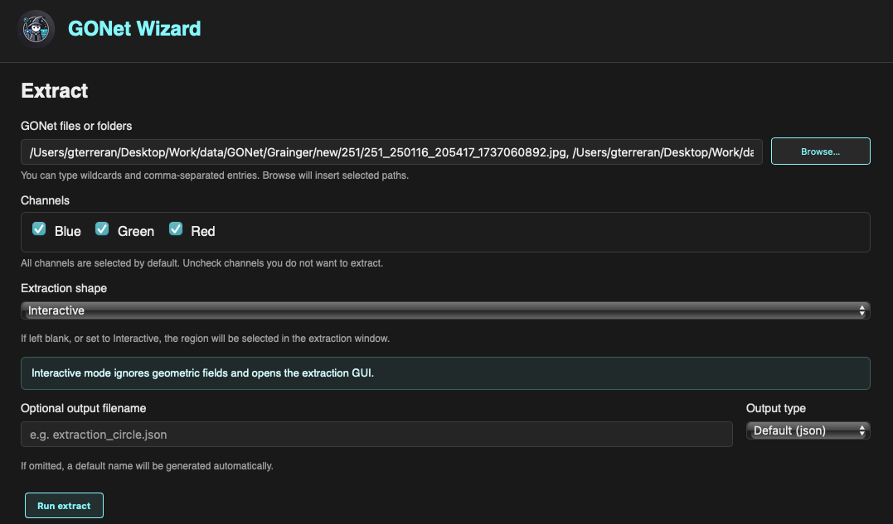
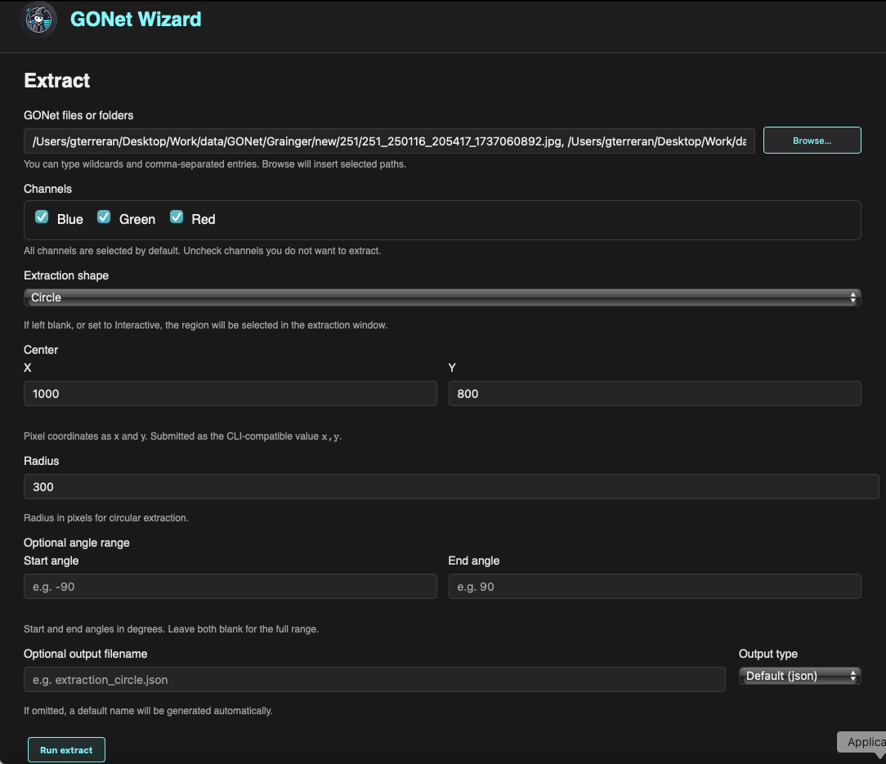

Extract
=======

The **Extract** form launches the GONet Wizard extraction tool from the
graphical interface.

.. note::

   This page explains how to configure and launch extraction from the GUI.

   To learn what extraction does, how extraction regions work, and how to
   interpret the output products, see :doc:`extraction tool guide <../tools/extract_measurements>`.

Overview
--------

The Extract form is used to select one or more GONet files, choose the color
channels to measure, define an extraction region, and save the resulting
measurements.

The form supports two workflows:

* **Interactive extraction**, where the dedicated extraction GUI opens and the
  region is selected visually.
* **Direct extraction**, where all required geometric parameters are provided
  in the form and extraction starts immediately.

Interactive Extraction
----------------------

Interactive mode is used when the extraction region should be selected
visually.

   Extract form configured for interactive extraction.

When **Interactive** is selected as the extraction shape, geometric parameter
fields are ignored and the dedicated extraction GUI opens after clicking
**Run extract**.

This workflow is useful when the region of interest is easier to define while
looking at the image.

Direct Extraction
-----------------

Direct extraction is used when the extraction geometry is already known.

   Extract form configured for direct circular extraction.

When a geometric shape is selected, the required parameters for that shape
must be provided in the form. If the parameters are valid, extraction starts
directly without opening the interactive extraction GUI.

This workflow is useful for repeated measurements, scripted-style processing,
or cases where the same extraction geometry should be applied to many files.

Selecting Files
---------------

The **GONet files or folders** field defines the input images.

Files can be selected in two ways.

Typing Paths
~~~~~~~~~~~~

Paths may be typed directly into the text field.

The field supports:

* Single file paths.
* Folder paths.
* Comma-separated entries.
* Wildcards.

This makes it possible to extract measurements from several files or groups of
files without using the file browser.

Browsing for Files
~~~~~~~~~~~~~~~~~~

The **Browse...** button opens a file picker.

Multiple files may be selected at once. When the selection is confirmed, the
selected paths are inserted into the input field automatically.

Channel Selection
-----------------

The **Channels** section controls which Bayer channels are extracted.

The available channels are:

* Blue
* Green
* Red

All channels are selected by default.

Uncheck any channel that should not be included in the extraction output.

For more information about GONet channels, see :doc:`channels user guide <../user_guide/channels>`.

Extraction Shape
----------------

The **Extraction shape** field controls whether extraction is performed
interactively or directly.

Interactive
~~~~~~~~~~~

The interactive option opens the dedicated extraction GUI.

In this mode, geometric fields in the form are ignored. The extraction region
is selected inside the extraction window instead.

Circle
~~~~~~

Circular extraction requires:

* Center ``X``
* Center ``Y``
* Radius

The center coordinates and radius are specified in pixels.

Rectangle
~~~~~~~~~

Rectangular extraction requires the rectangle parameters displayed by the form.

The selected rectangle is applied to every input file and selected channel.

Annulus
~~~~~~~

Annular extraction requires:

* Center ``X``
* Center ``Y``
* Inner radius
* Outer radius

The center coordinates and radii are specified in pixels.

Optional Angle Range
--------------------

Some geometric extraction shapes support angular limits.

If the angle fields are left blank, the complete shape is used.

If start and end angles are provided, only the corresponding sector of the
shape is extracted.

Angles are specified in degrees.

Output Filename
---------------

The **Optional output filename** field controls where the extraction results
are saved.

If the field is left blank, GONet Wizard generates a default output filename
automatically.

If a filename is provided, the extraction results are written to that file.

Output Type
-----------

The **Output type** field controls the output format.

Available output formats include:

* JSON
* CSV

JSON is the default output format.

For details about the structure of extraction outputs, see
:doc:`extraction tool guide <../tools/extract_measurements>`.

Running the Extraction
----------------------

To run an extraction:

#. Select one or more files or folders.
#. Choose the channels to extract.
#. Select an extraction shape.
#. Use **Interactive** mode or provide the required geometric parameters.
#. Optionally provide an output filename.
#. Select the output type.
#. Click **Run extract**.

Depending on the selected workflow, GONet Wizard either opens the interactive
extraction GUI or starts the extraction directly.

Extraction Feedback Terminal
----------------------------

The Extract form includes an **Extraction feedback** terminal panel below the
form controls.  This panel is the primary place to watch extraction progress
when running from the GUI, especially when using a packaged desktop app where no
separate terminal window is visible.

The terminal panel shows:

* the command equivalent submitted by the form;
* live progress output while files are processed;
* warnings and informational messages from GONet Wizard;
* error messages and traceback details when extraction fails;
* the full path to the JSON or CSV file written at the end of a successful run.

Terminal text is selectable, so paths, warnings, and tracebacks can be copied
for debugging or reporting issues.

For **Interactive** extraction, the region-selection window closes as soon as
**Extract** is clicked.  Processing then continues in the main Extract form's
feedback terminal so the user has a single place to follow progress and confirm
where the output file was saved.

Navigation Buttons
------------------

The buttons at the bottom of the window control the GUI session.

**Back to Main Menu**
   Returns to the launcher without running the current form.

**Exit**
   Closes the graphical interface.

Relationship to the CLI
-----------------------

The Extract form is the graphical frontend for the ``extract`` command.

Both interfaces use the same processing engine and produce the same extraction
products.

See Also
--------

* :doc:`extraction tool guide <../tools/extract_measurements>`
* :doc:`extractor architecture developer notes <../developer_notes/extractor_architecture>`
* :doc:`channels user guide <../user_guide/channels>`
* :doc:`extract CLI reference <../cli_reference/extract>`
* :doc:`GUI launcher guide <launcher>`
