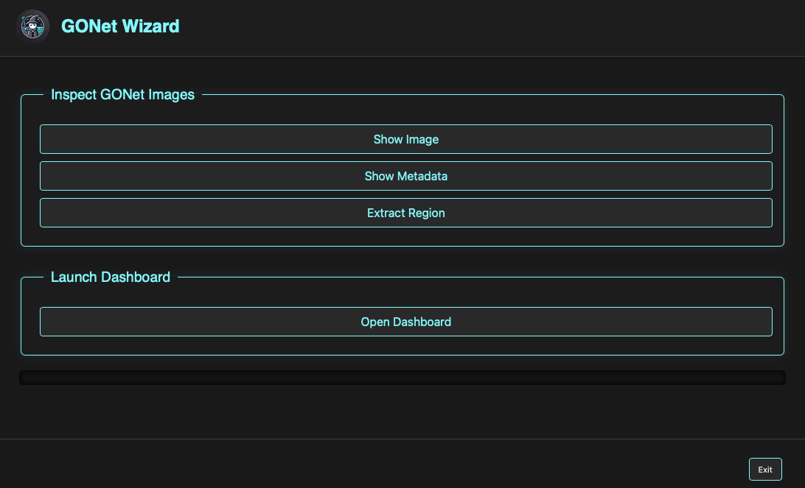

Launcher
========

The launcher is the main entry point of the GONet Wizard graphical user interface.

   GONet Wizard launcher window.

Overview
--------

The launcher provides access to the primary GONet Wizard tools:

* Show Image
* Show Metadata
* Extract Region
* Split RAW Images
* Dashboard

Each button opens a dedicated form used to configure and launch the
corresponding operation.

The launcher itself does not perform any processing. Instead, it serves as a
central access point to the underlying GONet Wizard command system.

.. note::

   The GUI is a frontend for the same processing engine used by the
   command-line interface.

   Operations performed through the GUI produce the same results as their
   command-line counterparts.

   To learn what each tool does, see:

   * :doc:`image inspection tool guide <../tools/inspect_images>`
   * :doc:`metadata inspection tool guide <../tools/inspect_metadata>`
   * :doc:`extraction tool guide <../tools/extract_measurements>`
   * :doc:`split RAW images tool guide <../tools/split_raw_images>`

Launcher Sections
-----------------

Image Inspection Tools
~~~~~~~~~~~~~~~~~~~~~~

The upper section of the launcher contains tools used to inspect and analyze
GONet observations.

**Show Image**

Launches the image inspection tool, which allows users to visualize Bayer
channels, compare observations, and explore image data interactively.

See :doc:`Show Image GUI guide <show>`.

**Show Metadata**

Launches the metadata inspection tool, which displays image metadata,
acquisition parameters, environmental information, and astronomical context.

See :doc:`Show Metadata GUI guide <show_meta>`.

**Extract Region**

Launches the extraction tool used to perform quantitative measurements within
user-defined regions of interest.

See :doc:`Extract GUI guide <extract>`.

**Split RAW Images**

Launches the RAW splitting tool used to convert original GONet RAW ``.jpg``
files into standard TIFF and JPEG products.

See :doc:`Split RAW Images GUI guide <split_raw>`.

Dashboard
~~~~~~~~~

The lower section of the launcher provides access to the GONet Dashboard.

The dashboard is an interactive environment for exploring extracted data
products and comparing observations.

See :doc:`Dashboard GUI guide <dashboard>`.

Typical Workflow
----------------

Many users interact with GONet Wizard through a workflow similar to:

#. Inspect images using **Show Image**.
#. Review acquisition information using **Show Metadata**.
#. Define measurement regions using **Extract Region**.
#. Convert RAW files to TIFF/JPEG products with **Split RAW Images** when portable image outputs are needed.
#. Analyze extracted products using the dashboard.

Depending on the task, users may skip some of these steps or move directly to
a specific tool.

Relationship to the Command Line Interface
------------------------------------------

Every launcher action corresponds to a command-line command.

================== ===================
GUI                CLI
================== ===================
Show Image         ``show``
Show Metadata      ``show_meta``
Extract Region     ``extract``
Split RAW Images   ``split_raw``
Dashboard          ``dashboard``
================== ===================

The GUI and CLI use the same underlying processing engine and therefore
produce identical outputs.

Choosing Between GUI and CLI
----------------------------

The graphical interface is generally the best choice when:

* Exploring new datasets.
* Inspecting images visually.
* Defining extraction regions interactively.
* Learning the available functionality.

The command-line interface is often preferable when:

* Processing large numbers of files.
* Automating workflows.
* Integrating GONet Wizard into scripts or pipelines.
* Repeating analyses with identical parameters.

Both interfaces are fully supported and may be used interchangeably.

See Also
--------

* :doc:`GUI vs CLI user guide <../user_guide/gui_vs_cli>`
* :doc:`Tools guide <../tools/index>`
* :doc:`CLI Reference <../cli_reference/index>`
* :doc:`Developer Notes <../developer_notes/index>`
