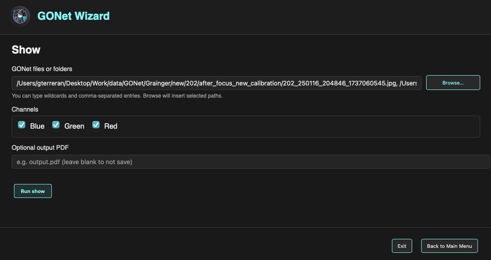

Show Image
==========

The **Show Image** form launches the GONet Wizard image inspection tool from
the graphical interface.

.. note::

   This page explains how to launch image inspection from the GUI.

   To learn what the image inspection tool does and how to use it effectively,
   see :doc:`image inspection tool guide <../tools/inspect_images>`.

   Show Image form in the GONet Wizard graphical interface.

Overview
--------

The Show Image form is used to select one or more GONet files and choose the
channels to display. export is handled from inside the interactive viewer
with the **Save figure** button.

After the form is submitted, GONet Wizard opens the image inspection viewer in
a dedicated window.

Selecting Files
---------------

The **GONet files or folders** field defines the input images.

Files can be selected in two ways.

Typing Paths
~~~~~~~~~~~~

Paths may be typed directly into the text field.

The field supports:

* Single file paths.
* Folder paths.
* Comma-separated entries.
* Wildcards.

This makes it possible to select several files or groups of files without
using the file browser.

Browsing for Files
~~~~~~~~~~~~~~~~~~

The **Browse...** button opens a file picker.

Multiple files may be selected at once. When the selection is confirmed, the
selected paths are inserted into the input field automatically.

Channel Selection
-----------------

The **Channels** section controls which Bayer channels are displayed.

The available channels are:

* Blue
* Green
* Red

By default, all three channels are selected.

The selected channels are applied to every file opened by the viewer. When
multiple files are shown, the same channels are displayed for each file,
making it easier to compare equivalent channels across observations.

For more information about GONet channels, see :doc:`channels user guide <../user_guide/channels>`.

Export from the Viewer
----------------------

The show form no longer asks for an output path before the viewer opens.
Instead, use the **Save figure** button inside the interactive viewer after you
have inspected or zoomed the figure.

When **Save figure** is clicked, GONet Wizard opens the operating-system save
dialog. After you choose a path, the viewer window closes immediately and the
export continues in the command feedback terminal on the form page. Static PDF, PNG, JPG, and SVG exports are rendered with GONet Wizard's
Matplotlib-based static exporter, not Plotly/Kaleido. This keeps packaged desktop
apps independent from a separate Chrome/Chromium backend. These static exports
include the same essential context as the viewer, including filenames, channel
labels, and the show grid arrangement. Save with an ``.html`` extension when you
want to preserve the fully interactive Plotly viewer.

Use **Exit** inside the viewer to close it without saving.

Running the Viewer
------------------

To launch the image inspection viewer:

#. Select one or more files or folders.
#. Choose the channels to display.
#. Click **Run show**.

The image inspection viewer opens in a separate window. Use **Save figure** in
that window to export a PDF, image, SVG, or interactive HTML file, or **Exit** to
close without saving.

Navigation Buttons
------------------

The buttons at the bottom of the window control the GUI session.

**Back to Main Menu**
   Returns to the launcher without running the current form.

**Exit**
   Closes the graphical interface.

Relationship to the CLI
-----------------------

The Show Image form is the graphical frontend for the ``show`` command.

Both interfaces use the same processing engine and produce the same image
inspection output.

See Also
--------

* :doc:`image inspection tool guide <../tools/inspect_images>`
* :doc:`channels user guide <../user_guide/channels>`
* :doc:`show CLI reference <../cli_reference/show>`
* :doc:`GUI launcher guide <launcher>`
