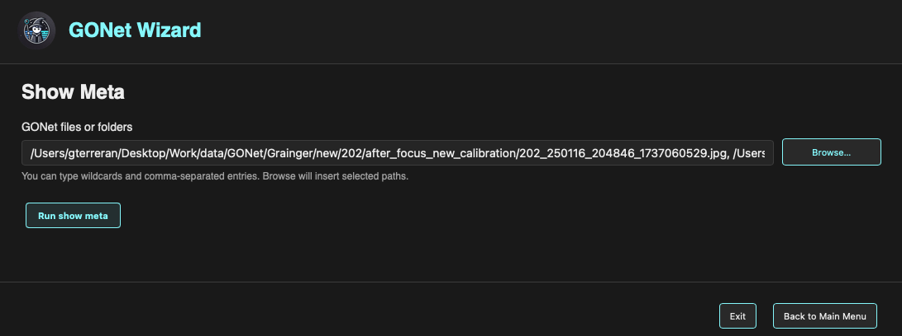

Show Metadata
=============

The **Show Metadata** form launches the GONet Wizard metadata inspection tool
from the graphical interface.

.. note::

   This page explains how to launch metadata inspection from the GUI.

   To learn what the metadata inspection tool displays and why those fields
   matter, see :doc:`metadata inspection tool guide <../tools/inspect_metadata>`.

   Show Metadata form in the GONet Wizard graphical interface.

Overview
--------

The Show Metadata form is used to select one or more GONet files and open a
metadata viewer.

The metadata viewer displays information such as camera configuration,
acquisition parameters, timestamps, image geometry, and other metadata stored
or derived from the selected observations.

Selecting Files
---------------

The **GONet files or folders** field defines the input images.

Files can be selected in two ways.

Typing Paths
~~~~~~~~~~~~

Paths may be typed directly into the text field.

The field supports:

* Single file paths.
* Folder paths.
* Comma-separated entries.
* Wildcards.

This makes it possible to inspect metadata for several files or groups of
files without using the file browser.

Browsing for Files
~~~~~~~~~~~~~~~~~~

The **Browse...** button opens a file picker.

Multiple files may be selected at once. When the selection is confirmed, the
selected paths are inserted into the input field automatically.

Running the Metadata Viewer
---------------------------

To launch the metadata inspection viewer:

#. Select one or more files or folders.
#. Click **Run show meta**.

The metadata viewer opens in a separate window.

Multiple Files
--------------

When multiple files are selected, metadata for each file is displayed in the
viewer.

The results can be inspected by scrolling through the output window.

Navigation Buttons
------------------

The buttons at the bottom of the window control the GUI session.

**Back to Main Menu**
   Returns to the launcher without running the current form.

**Exit**
   Closes the graphical interface.

Relationship to the CLI
-----------------------

The Show Metadata form is the graphical frontend for the ``show_meta``
command.

Both interfaces use the same processing engine and produce the same metadata
inspection output.

See Also
--------

* :doc:`metadata inspection tool guide <../tools/inspect_metadata>`
* :doc:`GONet images user guide <../user_guide/gonet_images>`
* :doc:`GONetFile user guide <../user_guide/gonetfile>`
* :doc:`show_meta CLI reference <../cli_reference/show_meta>`
* :doc:`GUI launcher guide <launcher>`
