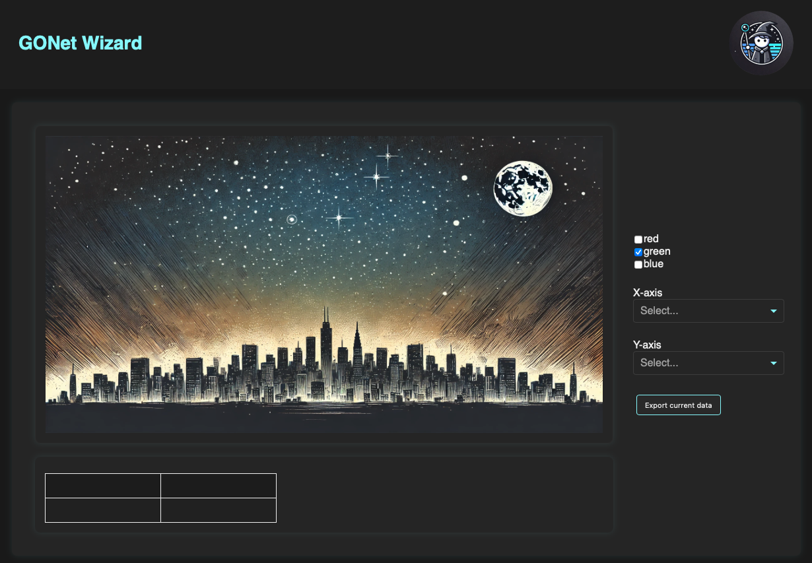
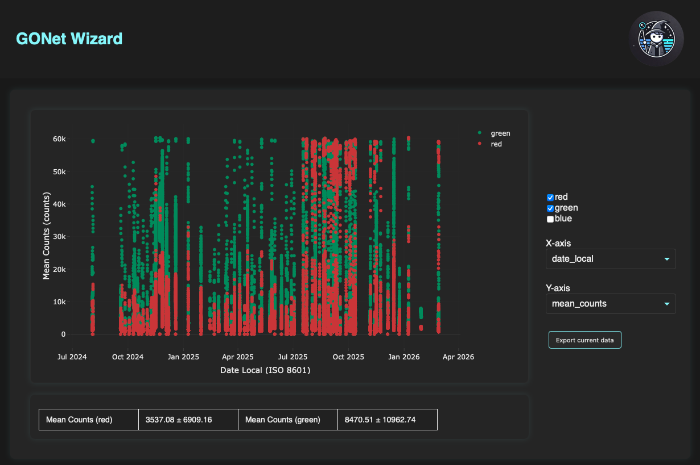
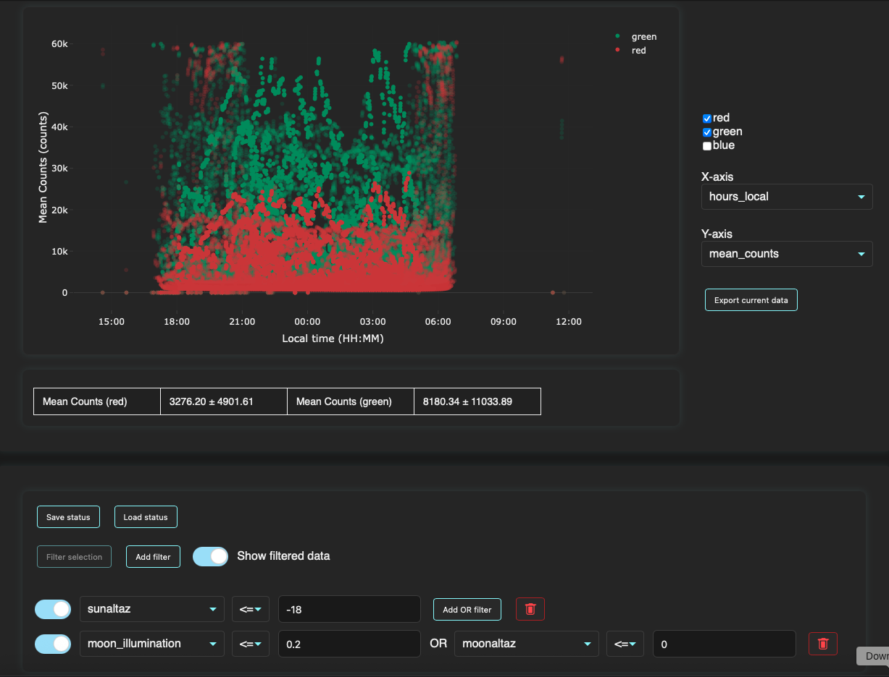

Dashboard
=========

The dashboard provides a quick-look interface for products generated by the
extraction command.

It is designed to help users inspect extracted JSON products, compare quantities
across observations, apply simple filters, inspect the source image associated
with selected observations, and export filtered subsets for more advanced
analysis elsewhere.

The dashboard is intentionally lightweight. It does not perform advanced
statistical analysis or scientific modeling. Instead, it provides an interactive
first-pass view of extraction results.

For launching instructions, see:

* :doc:`Dashboard GUI guide <../gui_guide/dashboard>`
* :doc:`dashboard CLI reference <../cli_reference/dashboard>`

Overview
--------

The dashboard works with JSON files produced by the ``extract`` command.

Users provide either:

* a list of extraction JSON files, or
* a folder containing extraction JSON files.

After launch, the dashboard reads the available JSON fields and uses them to
populate the plotting and filtering controls dynamically.

This means the dashboard is not limited to a fixed set of hardcoded columns. If
new extractors are added in the future and the extraction JSON products contain
new fields, those fields can automatically become available in the dashboard.

   Dashboard after launch, before plotting quantities have been selected.

Selecting Quantities to Plot
----------------------------

The controls on the right side of the dashboard define the plotted quantities.

The **X-axis** dropdown selects the quantity shown on the horizontal axis.

The **Y-axis** dropdown selects the quantity shown on the vertical axis.

Both dropdowns are populated from the fields available in the loaded JSON
products. The available choices therefore depend on the contents of the input
files.

Once both quantities are selected, the dashboard draws the corresponding scatter
plot.

Channel-Dependent Quantities
----------------------------

Some extraction quantities are channel dependent.

For example, ``mean_counts`` may be available separately for the red, green, and
blue channels.

When a selected quantity is channel dependent, the channel checkboxes can be
used to decide which channels are displayed.

The available channel controls are:

* red
* green
* blue

Users may display one channel, several channels, or all available channels.

   Dashboard showing ``date_local`` versus ``mean_counts`` for the red and
   green channels.

Plot Interaction Mode
---------------------

When the dashboard opens, the default click-and-drag behavior on the plot is
**lasso selection**, not rectangular zoom.

This differs from many Plotly figures, where the default drag behavior is often
zoom. In the dashboard, the default lasso mode is intentional because selected
groups of points can be converted directly into filters.

Users can still use the Plotly toolbar to change interaction modes when needed.

Summary Statistics
------------------

A quick summary table is shown below the plot.

For channel-dependent quantities, the table reports basic mean-count summaries
for the displayed channels.

The summary is intended as a quick reference while exploring the data. It is
not meant to replace a dedicated analysis workflow.

Hovering and Selecting Points
-----------------------------

Hovering over a point in the plot displays the exact values associated with
that observation.

The hover information also includes the night associated with the observation,
which helps connect plotted points to observing dates.

Clicking a point selects that observation.

When a point is selected:

* the selected point is enlarged in the plot,
* the source image associated with the observation is displayed when available,
* the extraction region is overlaid on the image when the stored shape
  information is sufficient,
* the full JSON information for that observation is shown lower in the
  dashboard.

The image is loaded from the ``filename`` field stored in the extraction JSON.
If the file cannot be found or cannot be opened, the dashboard shows a
non-breaking placeholder instead of interrupting the session.

This makes it possible to inspect one observation in detail without leaving the
interactive dashboard.

Filtering Data
--------------

The lower section of the dashboard contains the filter controls.

Filters allow users to restrict the displayed dataset using quantities present
in the loaded JSON products.

   Dashboard with filters applied to local time, mean counts, Sun altitude, Moon
   illumination, and Moon altitude.

Value Filters
~~~~~~~~~~~~~

Click **Add filter** to create a new value-based filter row.

New filters usually start disabled. Use the switch next to a filter to toggle
that filter on or off.

Each filter row contains:

* a dropdown selecting the quantity to filter,
* a logical comparison operator,
* a numeric value,
* a delete button.

The quantity dropdown is populated dynamically from the JSON fields available in
the loaded data products.

For example, a user can filter observations where the Sun altitude is less than
``-18`` degrees.

Selection Filters
~~~~~~~~~~~~~~~~~

The dashboard can also create filters from points selected directly on the
plot.

To create a selection filter:

#. Draw a lasso selection around a region of points in the plot.
#. Click **Filter selection**.
#. Enable the new filter using the switch next to it.

The resulting filter is associated with the selected group of points.

Selection filters can be either inclusive or exclusive:

* **inclusive** selection filters keep only the points inside the selected
  region,
* **exclusive** selection filters remove the points inside the selected region.

Multiple selection filters can be added. Each selection filter can be enabled,
disabled, removed, and configured independently.

This is useful when a pattern is visually obvious in the plot but would be
awkward to describe with simple numeric thresholds.

Removing Filters
~~~~~~~~~~~~~~~~

A filter can be removed using the bin button next to that filter row.

Temporarily Disabling Filters
~~~~~~~~~~~~~~~~~~~~~~~~~~~~~

A filter can be temporarily enabled or disabled using the switch next to the
filter.

This is useful when comparing the effect of different filter combinations
without deleting and recreating filters.

OR Filters
~~~~~~~~~~

A value-based filter row can include an additional **OR** condition.

For example, a user may filter on Moon-related quantities using a condition
such as:

.. code-block:: text

   moon_illumination <= 0.2 OR moonaltaz <= 0

This allows a single filter row to keep observations that satisfy either of the
listed criteria.

Filtered Points
---------------

By default, the dashboard keeps filtered-out points visible but makes them
transparent.

This allows users to see both:

* the observations that pass the active filters, and
* the observations that were removed by the filters.

For crowded plots, the **Show filtered data** toggle can be switched off. When
this toggle is off, filtered-out points disappear from the plot, making the
remaining selected subset easier to inspect.

Saving and Loading Dashboard Status
-----------------------------------

The dashboard can save its current configuration and restore it in a later
session.

Click **Save status** to open a **Save As** dialog. The suggested filename is
``dashboard_status.json``, but it can be changed before saving. Status files
always use the JSON format. If the chosen name has no extension, or has an
extension other than ``.json``, the filename is normalized to end in
``.json``.

The saved status includes:

* the selected X- and Y-axis quantities,
* the selected color channels,
* the **Show filtered data** setting,
* enabled and disabled value filters,
* optional OR conditions, and
* selection filters created from points on the plot.

Use **Load status** to select a previously saved status file. The dashboard
restores the saved plotting choices and reconstructs the saved filters. The
status file stores the dashboard configuration, not a copy of the underlying
extraction data, so the relevant data products must still be loaded separately.

Saving a status is useful for repeating an analysis or reusing a filter setup
across dashboard sessions.

Exporting Filtered Data
-----------------------

Click **Export current data** to open a **Save As** dialog for the current
filtered subset. The suggested filename is ``filtered_data.json``, and the
chosen destination is shown before the file is written. Export files always use
the JSON format. If the chosen name has no extension, or has an extension other
than ``.json``, the filename is normalized to end in ``.json``.

The exported file contains the observations that pass all active filters. This
is independent of the **Show filtered data** setting: filtered-out points may
remain visible with reduced opacity in the plot, but they are not included in
the export.

For each exported observation, the file includes all stored quantities
available to the dashboard, not only the X- and Y-axis quantities currently
shown on the plot.

This is the intended bridge between dashboard exploration and more advanced
analysis. Users can use the dashboard to identify a useful subset of
observations, export that subset, and then analyze it with their own scripts or
external tools.

Relationship to Extraction
--------------------------

The dashboard is primarily designed to inspect extraction outputs.

A typical workflow is:

#. Run ``extract`` on one or more GONet images.
#. Save the extraction products as JSON.
#. Launch the dashboard on the JSON files or on a folder containing them.
#. Plot quantities of interest.
#. Select points visually or apply value-based filters to identify useful
   observations.
#. Inspect selected observations and their source images.
#. Export the filtered subset for later analysis.

For more details about extraction products, see
:doc:`extraction measurements tool guide <extract_measurements>`.

Relationship to the GUI and CLI
-------------------------------

The dashboard can be launched from either the graphical interface or the command
line.

The GUI launcher provides a form where users select the data directory.

The CLI command provides the same functionality from the terminal.

For details, see:

* :doc:`Dashboard GUI guide <../gui_guide/dashboard>`
* :doc:`dashboard CLI reference <../cli_reference/dashboard>`

Limitations
-----------

The dashboard is intended for quick inspection and filtering.

It does not currently provide:

* advanced statistical modeling,
* calibration fitting,
* publication-ready analysis pipelines,
* domain-specific interpretation of plotted quantities.

Those tasks should be performed in dedicated analysis scripts or notebooks,
using dashboard exports as input when useful.

See Also
--------

* :doc:`extraction measurements tool guide <extract_measurements>`
* :doc:`Dashboard GUI guide <../gui_guide/dashboard>`
* :doc:`dashboard CLI reference <../cli_reference/dashboard>`
* :doc:`UI runtime developer notes <../developer_notes/ui_runtime>`
* :doc:`dashboard architecture developer notes <../developer_notes/dashboard_architecture>`
