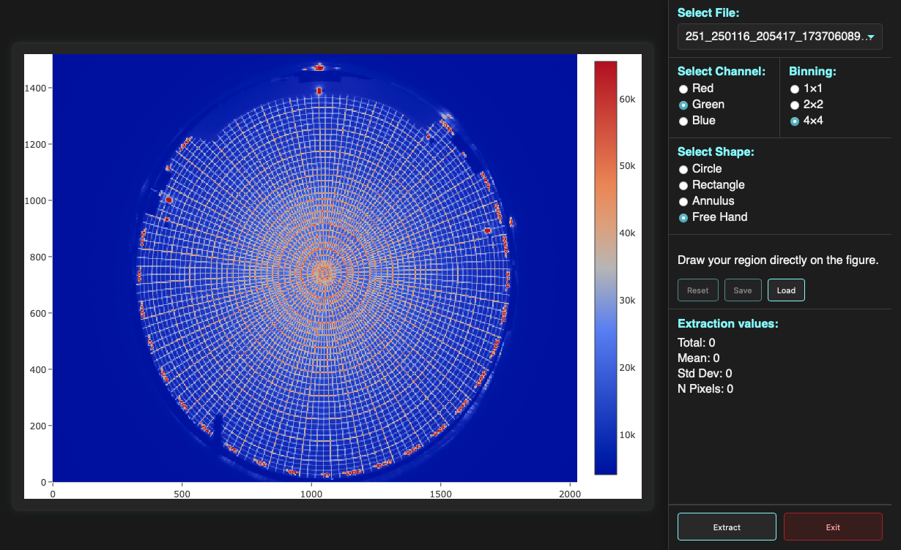

Extract Measurements
====================

The extraction tool is used to measure image counts within user-defined
regions of interest (ROIs).

Unlike the image inspection and metadata inspection tools, extraction
produces quantitative outputs that can be saved and analyzed later.

The extraction process can be launched either directly from the command line
or through the graphical interface.

Related Interfaces and Internals
--------------------------------

.. list-table::
   :header-rows: 1
   :widths: 35 65

   * - Need
     - Page
   * - Launch extraction from the GUI
     - :doc:`Extract GUI guide <../gui_guide/extract>`
   * - Run extraction from the terminal
     - :doc:`extract CLI reference <../cli_reference/extract>`
   * - Understand extractor internals
     - :doc:`extractor architecture developer notes <../developer_notes/extractor_architecture>`
   * - Review extraction modules, classes, and functions
     - :doc:`extraction API reference <../api_reference/extraction>`

Interactive vs Non-Interactive Extraction
-----------------------------------------

Extraction can operate in two different modes.

Non-Interactive Mode
~~~~~~~~~~~~~~~~~~~~

When all required extraction parameters are supplied through the command line
or GUI form, the extraction begins immediately.

This mode is ideal for automated processing and batch workflows involving
large numbers of files, or simply when the user already knows the desired
extraction parameters and does not need to interactively define them.

Interactive Mode
~~~~~~~~~~~~~~~~

When extraction parameters are not provided, the interactive extraction
interface is launched.

The interactive interface allows users to visually inspect images and define
the extraction region before measurements are performed.

   Interactive extraction interface.

Overview
--------

The extraction tool supports processing multiple files simultaneously.

Although extraction will be applied to every selected file, only a single file
is displayed at a time during interactive inspection.

When the interface opens:

* Files are sorted alphabetically.
* Only the first file is initially loaded.
* Additional files may be inspected using the file selector in the upper
  right corner.
* The same extraction parameters are applied to every file during the final
  extraction step.

This design minimizes loading time while still allowing representative images
to be inspected before launching a potentially long extraction process.

.. note::

   Extracting measurements from large datasets may require several minutes
   depending on image size, extraction geometry, and number of files.

Image Display
-------------

The extraction interface includes a lightweight image viewer optimized for
responsiveness.

Compared to the dedicated image inspection tool (see :doc:`image inspection tool guide <inspect_images>`), fewer visualization options
are available.

Channel Selection
~~~~~~~~~~~~~~~~~

Only one channel may be displayed at a time.

The displayed channel can be selected using the radio buttons located above
the image viewer.

Image Binning
~~~~~~~~~~~~~

To improve responsiveness, images are initially displayed using 4×4 binning.

Users may optionally switch to:

* 4×4 binning (default)
* 2×2 binning
* Full-resolution 1×1 display

Lower binning provides a more responsive experience, while full-resolution
display allows more precise placement of extraction regions.

Navigation
~~~~~~~~~~

When the interface first opens, click-and-drag is configured for zooming and
panning.

Navigation controls are available through the Plotly toolbar in the upper
right corner of the image viewer.

Extraction Geometries
---------------------

Four extraction modes are available:

* Circle
* Rectangle
* Annulus
* Free Hand

Circle
~~~~~~

The circular extraction region is the default mode when the interface opens.

Required parameters:

* Center (x, y pixels)
* Radius (pixels)

Rectangle
~~~~~~~~~

The rectangular extraction region requires:

* Center (x, y pixels)
* Width (pixels)
* Height (pixels)

Annulus
~~~~~~~

The annulus (ring) extraction region requires:

* Center (x, y pixels)
* Inner radius (pixels)
* Outer radius (pixels)

Angular Limits
~~~~~~~~~~~~~~

Circular, rectangular, and annular extraction regions also support angular
limits.

The default angular range is:

.. code-block:: text

   -180° to +180°

which corresponds to the complete geometry.

By adjusting the angular limits, users may extract only a sector of the
selected region.

Examples include:

* Circular wedges
* Partial annuli
* Sector-shaped regions

.. note::

   Not all geometry fields are present in every extraction record. The set of
   geometry parameters depends on the selected extraction shape. For example,
   circular extractions include ``radius``, while annular extractions include
   ``inner_radius`` and ``outer_radius``.

Interactive Region Preview
--------------------------

As soon as a valid set of parameters is entered, the extraction geometry is
drawn on top of the image.

The overlay updates automatically whenever parameters are modified.

This provides immediate visual feedback and allows users to precisely verify
the extraction region before measurements are performed.

Quick Measurement Preview
-------------------------

Whenever a valid extraction region is present, a quick measurement preview is
displayed.

The preview reports the counts measured within the selected region for the
currently displayed file and channel.

This allows users to rapidly evaluate candidate extraction regions before
launching the full extraction.

Free-Hand Extraction
--------------------

Free-hand extraction provides a flexible alternative to the predefined
geometries.

In free-hand mode:

* Zoom-drag behavior is disabled.
* Mouse dragging is used to draw extraction regions.
* Shapes automatically close when drawing is completed.
* Measurement previews are generated after the shape is completed.

Editing Free-Hand Shapes
~~~~~~~~~~~~~~~~~~~~~~~~

Free-hand shapes remain editable while free-hand mode is active.

Users may:

* Select existing shapes.
* Move shapes.
* Modify vertices.
* Add additional vertices.
* Resize regions by dragging control points.

Multiple Regions
~~~~~~~~~~~~~~~~

Unlike the predefined extraction geometries, free-hand mode supports multiple
simultaneous extraction regions.

This makes it possible to measure complex structures that cannot easily be
described by a single circle, rectangle, or annulus.

Saving and Loading Shapes
~~~~~~~~~~~~~~~~~~~~~~~~~

Free-hand regions can be saved and loaded.

Saved regions may be reused across multiple extraction sessions, ensuring
consistent measurements between datasets.

Deleting Shapes
~~~~~~~~~~~~~~~

To delete a free-hand region:

1. Select the desired shape.
2. Press the Delete key.

Persistent Shapes
~~~~~~~~~~~~~~~~~
.. warning::

   Free-hand regions are interactive only while free-hand mode is active.
   Switching to another extraction mode disables editing of existing
   free-hand regions, not even by switching back to free-hand mode.

   In addition, free-hand shapes remain visible after switching to
   another extraction mode, and they will not be deletable either.

Launching the Extraction
------------------------

Once a satisfactory extraction region has been defined, users may click
**Extract**.

The extraction process then runs in the background and is applied to all
selected files.

Clicking **Exit** closes the interface without performing any extraction.

Output Formats
--------------

Extracted measurements can be written in two formats:

* JSON (default)
* CSV

Understanding the Output
------------------------

Extraction results are written as one record per input file.

In JSON output, the file contains a list of dictionaries. Each dictionary
corresponds to one extracted image.

In CSV output, the same information is flattened into a table, with one row
per file and one column per field.

File and Camera Fields
~~~~~~~~~~~~~~~~~~~~~~

``filename``
   Path or basename of the extracted image file.

``camera``
   Camera identifier, usually extracted from the filename or metadata.

``unix_time``
   Unix timestamp of the exposure, in seconds since 1970-01-01 UTC.

Extraction Geometry Fields
~~~~~~~~~~~~~~~~~~~~~~~~~~

``shape``
   Extraction region type. Common values include ``circle``, ``rectangle``,
   ``annulus``, and ``freehand``.

``x0``, ``y0``
   Center coordinates of the extraction region, in pixels.

``radius``
   Radius of a circular extraction region, in pixels.

``side1``, ``side2``
   Side lengths of a rectangular extraction region, in pixels.

``inner_radius``, ``outer_radius``
   Inner and outer radii of an annular extraction region, in pixels.

``start_angle``, ``end_angle``
   Angular limits of the extraction region, in degrees.

   A range from ``-180`` to ``180`` corresponds to the complete shape. Smaller
   ranges define a sector of the selected geometry.

.. note::

   Not all geometry fields are present in every extraction record. The set of
   geometry parameters depends on the selected extraction shape. For example,
   circular extractions include ``radius``, while annular extractions include
   ``inner_radius`` and ``outer_radius``.

Weather and Environmental Fields
~~~~~~~~~~~~~~~~~~~~~~~~~~~~~~~~

``temperature``
   Ambient temperature.

``dew_point``
   Dew point temperature.

``wind_speed``
   Wind speed.

``pressure``
   Atmospheric pressure.

``humidity``
   Relative humidity.

``condition_code``
   Encoded weather condition indicator.

Astronomical and Timing Fields
~~~~~~~~~~~~~~~~~~~~~~~~~~~~~~

``sunaltaz``
   Solar altitude at the time of the exposure, in degrees.

``moonaltaz``
   Lunar altitude at the time of the exposure, in degrees.

``moon_illumination``
   Illuminated fraction of the Moon, from ``0`` to ``1``.

``night``
   Observing-night identifier in ``YYYYMMDD`` format.

``date_utc``
   Exposure timestamp in UTC.

``date_local``
   Exposure timestamp in local time.

``mjd``
   Modified Julian Date of the exposure.

``hours_utc``
   UTC time as ``HH:MM:SS``.

``hours_local``
   Local time as ``HH:MM:SS``.

``float_hours_utc``
   UTC time expressed as a fractional day.

``float_hours_local``
   Local time expressed as a fractional day.

Channel Measurement Fields
~~~~~~~~~~~~~~~~~~~~~~~~~~

Each color channel is stored as a nested dictionary in JSON output.

The standard channels are:

* ``red``
* ``green``
* ``blue``

Each channel contains the same measurement fields.

``total_counts``
   Sum of all pixel values inside the extraction region.

``mean_counts``
   Mean pixel value inside the extraction region.

``std``
   Standard deviation of pixel values inside the extraction region.

``npixels``
   Number of pixels included in the extraction region.

CSV Field Names
~~~~~~~~~~~~~~~

In CSV output, nested channel measurements are flattened by prefixing each
field with the channel name.

For example:

* ``red_total_counts``
* ``red_mean_counts``
* ``red_std``
* ``red_npixels``
* ``green_total_counts``
* ``green_mean_counts``
* ``green_std``
* ``green_npixels``
* ``blue_total_counts``
* ``blue_mean_counts``
* ``blue_std``
* ``blue_npixels``

The CSV file therefore contains one row per image and one column per extracted
quantity.

Additional Information
----------------------

The exact set of fields written by an extraction depends on the selected
extractor and the metadata available for the input files.

See :doc:`extractor architecture developer notes <../developer_notes/extractor_architecture>` for detailed descriptions of individual extractors,
their parameters, and any extractor-specific output fields.

The same extraction results returned by the command-line interface are also
available through the Python API. See :doc:`extraction API reference <../api_reference/extraction>` for examples of running
extractors and processing the returned dictionaries directly.
