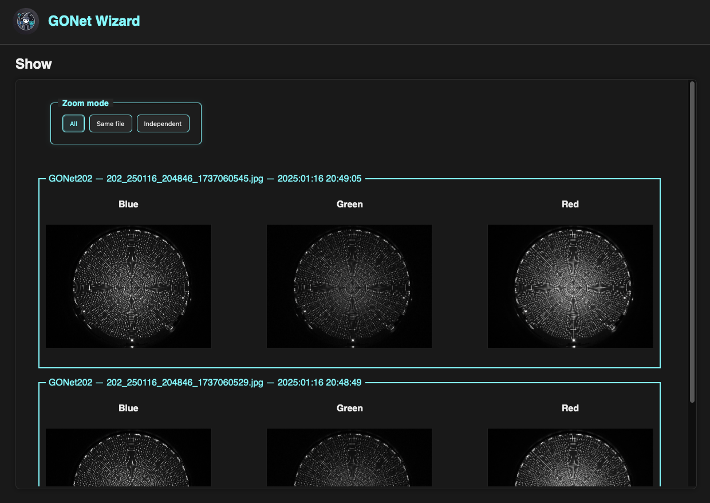

Inspect Images
==============

The image inspection tool allows users to explore both the visual appearance
and the underlying sensor measurements contained in GONet observations.

Unlike conventional image viewers, GONet Wizard can display the individual
Bayer channels recorded by the camera sensor, making it possible to inspect
both processed imagery and the underlying RAW data.

The tool is designed not only for image viewing, but also for comparison and
exploration across multiple observations.

   The image inspection tool displaying multiple observations and Bayer channels.

Typical Uses
------------

The image inspection tool is commonly used to:

* Evaluate image quality.
* Compare multiple observations.
* Identify saturated regions.
* Inspect Bayer channels individually.
* Verify focus and exposure.
* Explore image features before performing measurements.

Supported Files
----------------

Image inspection works with original RAW ``.jpg`` GONet images,
as well as with derived products like converted ``.tiff`` files.

Multiple Files
--------------

Multiple images can be displayed simultaneously within the same viewer.

Each selected file is displayed in its own section and can be inspected
independently or compared against other observations.

When several files are loaded, the viewer becomes a powerful comparison tool
for studying changes between observations, evaluating image quality, or
tracking the evolution of a scene over time.

.. warning::

   GONet images contain both JPEG and RAW Bayer data and can be relatively
   large (approximately 20 MB per file).

   Loading a large number of images simultaneously may significantly increase
   memory usage and reduce responsiveness.

Channel Selection
-----------------

The displayed channels can be selected by the user.

By default, the viewer displays the Blue, Green, and Red Bayer channels,
but alternative channel combinations may also be displayed depending on the
selected visualization mode.

The same channel selection is applied to all loaded images.

When multiple files are displayed simultaneously, identical channels are
aligned in the same column. This makes it easy to compare the same Bayer
channel across multiple observations.

For a detailed discussion of channels, see :doc:`channels user guide <../user_guide/channels>`.

Interactive Navigation
----------------------

The viewer uses standard Plotly interactions.

Zooming
~~~~~~~

To zoom into a region of interest:

1. Click and drag on the image.
2. Release the mouse button to zoom to the selected region.

To reset the zoom:

* Double-click anywhere within the image.

Panning
~~~~~~~

After zooming, the image may be panned using the standard Plotly toolbar
controls.

Inspection
~~~~~~~~~~

The viewer supports interactive exploration of image data, allowing users
to quickly move between large-scale image features and fine pixel-level
structure.

Zoom Synchronization Modes
--------------------------

When multiple images and channels are displayed, the viewer can synchronize
zoom operations across related plots.

Three synchronization modes are available.

All
~~~

The default mode.

Zooming or panning any image updates every displayed channel of every loaded
file.

This mode is useful when comparing multiple observations of the same target.

Same File
~~~~~~~~~

Zoom operations are synchronized only between channels belonging to the same
image.

This mode is useful when comparing Bayer channels within a single observation
while allowing different files to remain independent.

Independent
~~~~~~~~~~~

Zoom operations affect only the selected plot.

No synchronization is performed.

This mode is useful when examining different regions of different images
simultaneously.

Accessing the Tool
------------------

The image inspection tool can be accessed through both the graphical user
interface and the command-line interface.

See:

* :doc:`Show Image GUI guide <../gui_guide/show>`
* :doc:`show CLI reference <../cli_reference/show>`

Where to Go Next
----------------

.. list-table::
   :header-rows: 1
   :widths: 35 65

   * - Need
     - Page
   * - Launch image inspection from the GUI
     - :doc:`Show Image GUI guide <../gui_guide/show>`
   * - Run image inspection from the terminal
     - :doc:`show CLI reference <../cli_reference/show>`
   * - Understand Bayer channels
     - :doc:`channels user guide <../user_guide/channels>`
   * - Review the implementation API
     - :doc:`show API reference <../api_reference/show>`

Related Topics
--------------

* :doc:`metadata inspection tool guide <inspect_metadata>`
* :doc:`extraction tool guide <extract_measurements>`
* :doc:`channels user guide <../user_guide/channels>`
* :doc:`GONet images user guide <../user_guide/gonet_images>`
