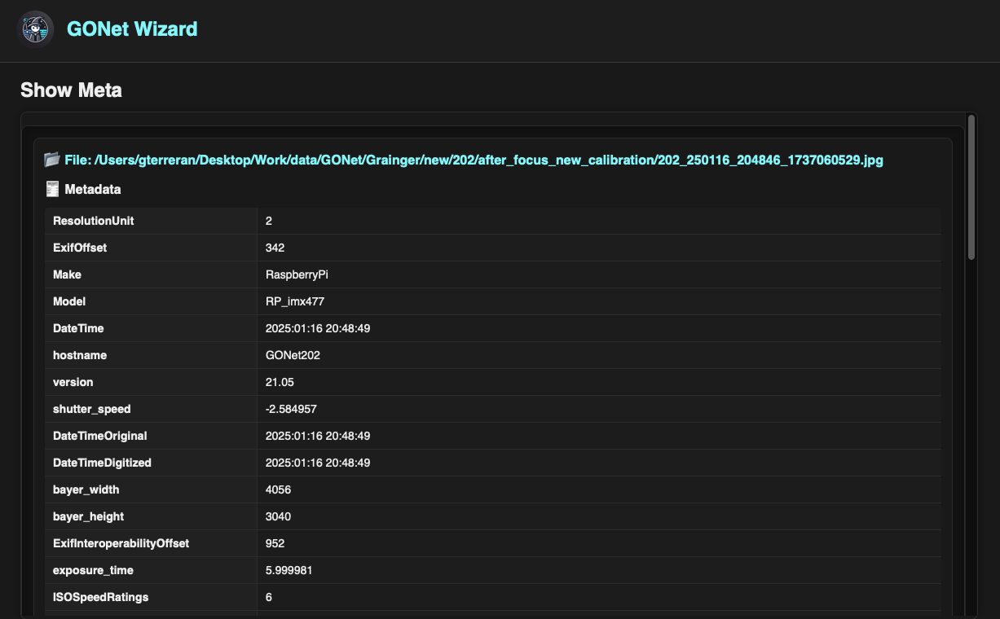

Inspect Metadata
================

Every GONet observation contains a substantial amount of metadata describing
the circumstances under which the image was acquired.

The metadata inspection tools provide a convenient way to explore this
information without manually parsing image headers or embedded data structures.

   The metadata inspection tool displaying acquisition and camera information
   for a GONet observation.

Typical Uses
------------

The metadata inspection tool is commonly used to:

* Verify acquisition settings.
* Confirm exposure times and ISO values.
* Check camera configuration.
* Compare observations from multiple cameras.
* Review image dimensions and Bayer resolution.
* Verify timestamps and observation chronology.
* Inspect environmental and location information.
* Troubleshoot unexpected image characteristics.

Multiple Files
--------------

Multiple images may be inspected simultaneously.

Each file is displayed in its own metadata section, allowing observations to be
compared side-by-side by scrolling through the results.

This is particularly useful when comparing observations acquired under
different conditions or from different cameras.

.. warning::

   Loading a large number of files simultaneously may increase memory usage and
   reduce responsiveness.

Available Information
---------------------

Depending on the contents of the image, the metadata viewer may display
information from several categories.

Camera Information
~~~~~~~~~~~~~~~~~~

Information describing the camera and acquisition software.

Examples include:

* Camera model.
* Hostname.
* Software version.
* Sensor configuration.

Acquisition Parameters
~~~~~~~~~~~~~~~~~~~~~~

Information describing how the image was acquired.

Examples include:

* Exposure time.
* ISO setting.
* Analog gain.
* White balance configuration.
* Shutter speed.

Timing Information
~~~~~~~~~~~~~~~~~~

Observation timestamps and acquisition chronology.

Examples include:

* DateTime
* DateTimeOriginal
* DateTimeDigitized

Image Geometry
~~~~~~~~~~~~~~

Information describing image dimensions.

Examples include:

* JPEG width and height.
* Bayer width and height.
* Sensor resolution.

Location Information
~~~~~~~~~~~~~~~~~~~~

When available, geographic information may be present.

Examples include:

* Latitude.
* Longitude.
* Altitude.

Image Encoding Information
~~~~~~~~~~~~~~~~~~~~~~~~~~

Low-level image and EXIF metadata.

Examples include:

* Color space.
* Component configuration.
* Resolution units.
* JPEG encoding parameters.

Accessing the Tool
------------------

The metadata inspection tool can be accessed through both the graphical user
interface and the command-line interface.

See:

* :doc:`Show Metadata GUI guide <../gui_guide/show_meta>`
* :doc:`show_meta CLI reference <../cli_reference/show_meta>`

Where to Go Next
----------------

.. list-table::
   :header-rows: 1
   :widths: 35 65

   * - Need
     - Page
   * - Launch metadata inspection from the GUI
     - :doc:`Show Metadata GUI guide <../gui_guide/show_meta>`
   * - Run metadata inspection from the terminal
     - :doc:`show_meta CLI reference <../cli_reference/show_meta>`
   * - Understand GONet image structure
     - :doc:`GONet images user guide <../user_guide/gonet_images>`
   * - Review the implementation API
     - :doc:`show API reference <../api_reference/show>`

Related Topics
--------------

* :doc:`image inspection tool guide <inspect_images>`
* :doc:`extraction tool guide <extract_measurements>`
* :doc:`GONet cameras user guide <../user_guide/gonet_cameras>`
* :doc:`GONetFile user guide <../user_guide/gonetfile>`
