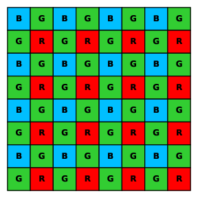

.. _user-guide-channels:

Channels
========

Channels are one of the central concepts in GONet Wizard. A GONet camera uses a
Bayer color filter array, so each raw sensor pixel measures light through one
color filter. The raw image is therefore not stored as three fully sampled color
images. It is stored as a mosaic of red, green, and blue filtered pixels.

GONet Wizard exposes those measurements as channel arrays.

Bayer pattern
-------------

The GONet raw data use a BGGR Bayer pattern. In a Bayer mosaic, neighboring
pixels sample different color filters. A simplified 2x2 Bayer tile looks like
this:

.. code-block:: text

   B G
   G R

The pattern repeats across the sensor. This means that red, blue, and the two
green positions are sampled at different pixel locations.

   BGGR Bayer mosaic used by the GONet image sensor.

Red, green, and blue channels
-----------------------------

GONet Wizard commonly works with these channel names:

``red``
    Pixels sampled through the red filter positions in the Bayer mosaic.

``green``
    A combined green channel, used by file representations that expose a single
    green plane.

    ``green1`` and ``green2``
        The two distinct green positions in the Bayer tile. Raw Bayer data contain
        two green samples per 2x2 tile, and :class:`~GONet_Wizard.GONet_utils.src.gonet.gonet_file_raw.GONetFileRaw`
        can preserve them as separate arrays.

``blue``
    Pixels sampled through the blue filter positions in the Bayer mosaic.

Why there are two green channels
--------------------------------

A Bayer tile contains two green pixels because the human visual system is most
sensitive to luminance, and green filters contribute strongly to luminance
information. For GONet Wizard, this means that a raw Bayer representation can
preserve two separate green planes.

Some workflows combine the two green samples into one ``green`` channel for
simplicity. Other workflows keep ``green1`` and ``green2`` separate so that no
Bayer-position information is lost.

Full-array representation
-------------------------

A channel plane is smaller than the full sensor array because it contains only
pixels from one color-filter position. In some workflows, GONet Wizard can build
a full-array representation by placing channel values back into their original
Bayer locations.

This is useful when a downstream task needs an image-shaped array that preserves
the original sensor geometry. It is different from creating an RGB image: the
full array is still a sensor-value product, not a display image.

Where to Go Next
----------------

* :doc:`image inspection tool guide <../tools/inspect_images>`
* :doc:`extraction tool guide <../tools/extract_measurements>`
* :doc:`build_full_array CLI reference <../cli_reference/build_full_array>`
* :doc:`GONetFile API reference <../api_reference/gonet>`

