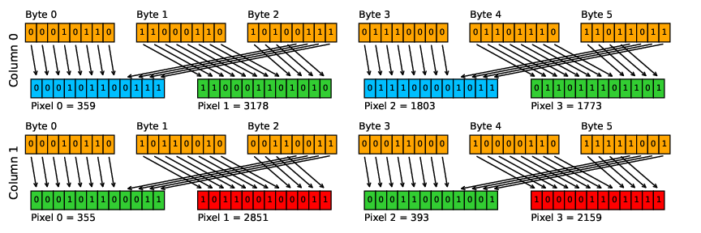

.. _user-guide-gonetfile:

The GONetFile Object
====================

``GONetFile`` is the main in-memory representation used by GONet Wizard. It is
the bridge between the physical image file on disk and the tools that inspect,
plot, transform, or extract measurements from that image.

This page explains the concept. The full API details are documented in the
:doc:`API Reference <../api_reference/index>`.

Why GONetFile exists
--------------------

A GONet image file can contain several kinds of information:

- image data;
- raw Bayer data;
- channel arrays;
- metadata;
- file-format information.

Rather than passing these pieces around separately, GONet Wizard loads them into
a structured object. This gives the rest of the package a consistent way to ask
for channels, metadata, filenames, and output representations.

Conceptual structure
--------------------

A :class:`~GONet_Wizard.GONet_utils.src.gonet.gonet_file.GONetFile` stores:

``filename``
    The source filename associated with the image.

``filetype``
    The interpreted file type. The raw comes with a ``.jpg`` extension,
    but some GONet files were previously converted to TIFF.
    The file type is determined by the file extension and internal content.

``meta``
    Metadata extracted from the image and related sources. Note that metadata
    are not available for TIFF files.

``channels``
    Channel arrays such as ``red``, ``green``, and ``blue``.

The exact channel layout depends on which object is used. The standard
:class:`~GONet_Wizard.GONet_utils.src.gonet.gonet_file.GONetFile` representation
uses a single green channel, while
:class:`~GONet_Wizard.GONet_utils.src.gonet.gonet_file_raw.GONetFileRaw` can
preserve ``green1`` and ``green2`` separately.

GONetFile and GONetFileRaw
--------------------------

The two primary file-model classes serve related but distinct purposes:

:class:`~GONet_Wizard.GONet_utils.src.gonet.gonet_file.GONetFile`
    A general-purpose representation of a GONet image with standard channel
    access and metadata handling.

:class:`~GONet_Wizard.GONet_utils.src.gonet.gonet_file_raw.GONetFileRaw`
    A raw-oriented representation that can expose separate Bayer planes,
    including ``green1`` and ``green2``.

Most users do not need to instantiate these classes directly. They are created
by the package when files are loaded through commands, GUI workflows, or helper
functions.

Byte Parsing
------------

In a GONet image, each pixel is encoded with 12 bits, and every group of two pixels
is packed into 3 consecutive bytes. The format is as follows:

- **Byte 0**: lower 8 bits of Pixel 0  
- **Byte 1**: lower 8 bits of Pixel 1  
- **Byte 2**: upper 4 bits of both Pixel 0 and Pixel 1, packed as two nibbles

This packaging is commonly known as a *12-bit packed little endian* format.
The following diagram shows how 3 bytes form 2 pixel values:

   Packing of 12-bit pixel values into 8-bit bytes.

In :meth:`GONetFile._parse_jpg_file` raw files are read in binary mode.
In order to reconstruct the original pixels values from the bytes,
the following procedures are executed. Let's assume the bytes are listed
in a ``bytes_array`` :mod:`numpy.array`

- To recreate the first pixel, the first element of every block of 3 elements
  of ``bytes_array`` is left shifted by 4 bits (using the operator ``<<``).
  The third element of every block of 3 elements is then cut to the first 4
  less significant bits (done by using an ``&`` operator with the number 15,
  which is 1111). These 2 new numbers are then summed.

  .. code-block:: python

    byte0 = b'00010110'
    byte0_left_shifted = byte0 << 4 # -> 000101100000
    byte2 = b'10100111'
    byte2_cut = byte2 & 15 # -> 0111
    pixel0 = byte0_left_shifted + byte2_cut # -> 000101100111

- To recreate the second pixel, the second element of every block of 3 elements
  of ``bytes_array`` is left shifted by 4 bits. The third element of every block
  of 3 elements is then right shifted by 4 bits (using the operator ``>>``).
  These 2 new numbers are then summed.

  .. code-block:: python

    byte0 = b'11000110'
    byte0_left_shifted = byte0 << 4 # -> 110001100000
    byte2_right_shifted = byte2 >> 4 # -> 1010
    pixel1 = byte0_left_shifted + byte2_right_shifted # -> 110001101010

Each recreated pixel is then stored in each channel following the Bayer pattern. 

Relationship to commands and the GUI
------------------------------------

Both the CLI and the GUI ultimately operate on GONet file objects. For example,
when the user asks GONet Wizard to show an image, inspect metadata, or extract
measurements, the input file is first normalized into one of these internal
representations.

This design is one of the reasons the GUI and CLI can share the same processing
engine: they both work with the same internal model of a GONet image.

Where to Go Next
----------------

* :doc:`GONetFile API reference <../api_reference/gonet>`
* :doc:`GONet parsers and writers API reference <../api_reference/gonet_parsers_writers>`
* :doc:`command-system developer notes <../developer_notes/command_system>`

